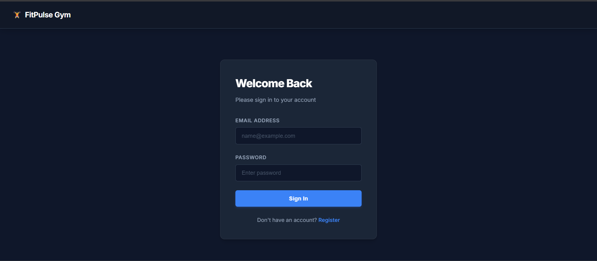
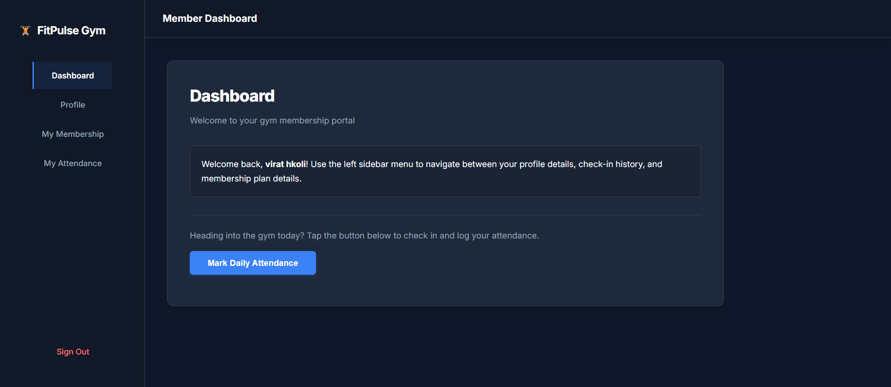
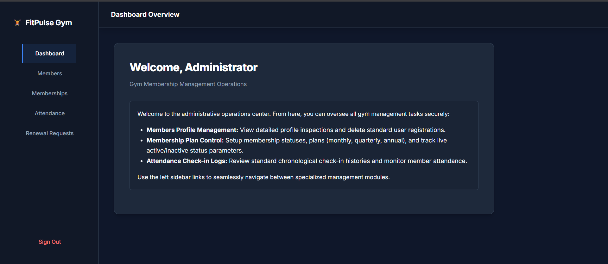
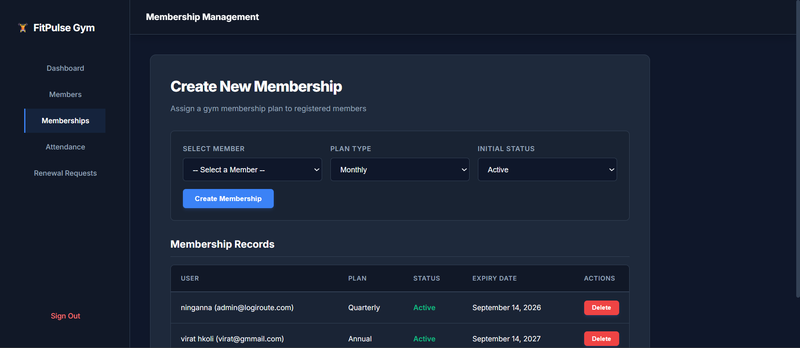
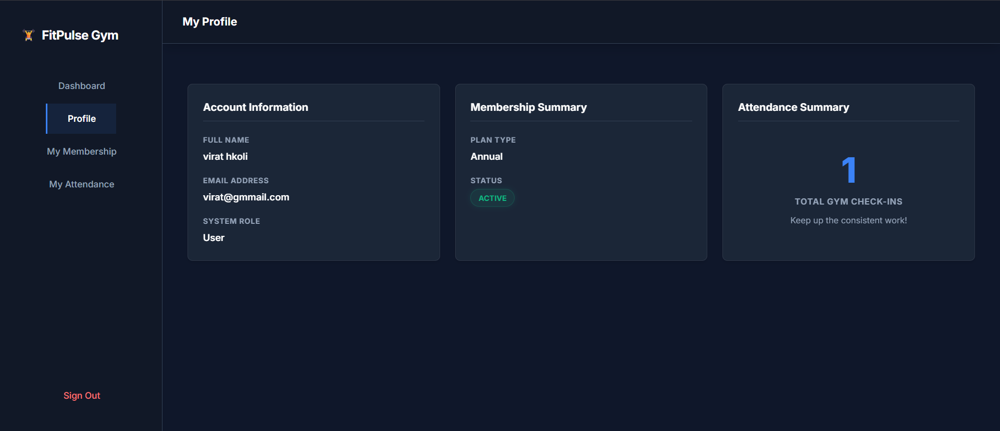
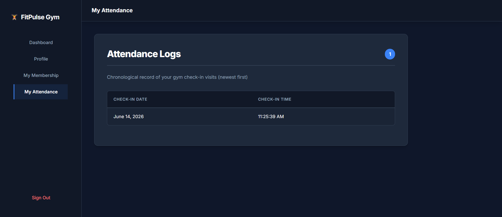
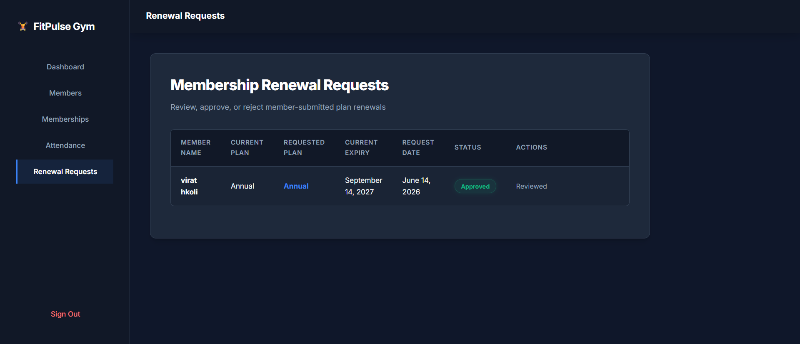

# Gym Membership Management System

A full-stack web application for managing gym memberships, attendance tracking, member records, and membership renewals with secure authentication and role-based access control.

---

## Features

### Member Features

- User Registration
- User Login
- Profile Management
- View Membership Details
- Attendance Tracking
- Attendance History
- Membership Renewal Requests

### Admin Features

- Admin Dashboard
- Member Management
- Membership Management
- Attendance Monitoring
- Approve/Reject Renewal Requests
- Cascade User Deletion

---

## Technology Stack

### Frontend
- HTML5
- CSS3
- JavaScript

### Backend
- Node.js
- Express.js

### Database
- MongoDB Atlas

### Authentication & Security
- JWT Authentication
- bcryptjs Password Hashing
- Role-Based Authorization
- Protected API Routes

---

## Security Features

- JWT-Based Authentication
- Password Hashing using bcryptjs
- Role-Based Access Control
- Duplicate Attendance Prevention
- Duplicate Renewal Request Prevention
- Cascade Deletion Protection

---

## Project Modules

### User Module
- Registration
- Login
- Profile Management
- Membership Details
- Attendance Tracking
- Membership Renewal Requests

### Admin Module
- Dashboard Analytics
- Member Management
- Membership Management
- Attendance Monitoring
- Renewal Request Management

---

## Project Structure

```text
gym-membership-management-system/
│
├── client/
│   ├── css/
│   ├── js/
│   └── pages/
│
├── server/
│   ├── config/
│   ├── controllers/
│   ├── middleware/
│   ├── models/
│   ├── routes/
│   └── server.js
│
├── SCREENSHOTS/
│
└── README.md
```

## Installation

### 1. Clone Repository

```bash
git clone https://github.com/Rajat-Biradar/gym-membership-management-system.git
```

### 2. Navigate to Server Folder

```bash
cd gym-membership-management-system/server
```

### 3. Install Dependencies

```bash
npm install
```

### 4. Configure Environment Variables

Create a `.env` file inside the server folder.

```env
MONGO_URI=your_mongodb_connection_string
JWT_SECRET=your_jwt_secret
PORT=5000
```

### 5. Start Server

```bash
npm start
```

### 6. Open Frontend

Open the HTML pages from:

```text
client/pages/
```

---

## Screenshots

### Login Page


### User Dashboard


### Admin Dashboard


### Membership Management


### Profile Page


### Attendance Tracking


### Membership Renewal


---

## Key Highlights

- Full Stack Web Application
- JWT Authentication
- MongoDB Database Integration
- Role-Based Authorization
- Responsive User Interface
- Admin and Member Dashboards
- Membership Renewal Workflow
- Attendance Management System

---

## Author

**Rajat R Biradar**  
Bachelor of Engineering (BE)  
Information Science and Engineering

GitHub: https://github.com/Rajat-Biradar